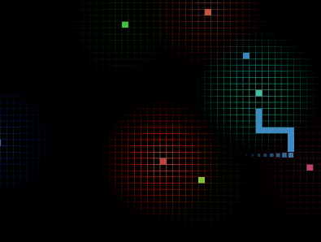

# Simple Snake

**Made with <3 by [mateus.digital](https://mateus.digital).**


<p align="center">
    
</p>

## Description:

Simple Snake is __syntwave-esque__ rendition of the classic snake game.

You can [play it online](https://mateus.digital/simple_snake).

<br>

As usual, you are **very welcomed** to **share** and **hack** it.


## Building


```bash
git clone https://github.com/mateus.digital/simple_snake
cd simple_snake
./scripts/build-static.sh      ## Builds the webpage for the game.
```
## Thanks to:

I used a lot of free and open resources, for which I'm most grateful!

- [chroma.js](https://www.vis4.net/chromajs/)

## License:

This software is released under [GPLv3](https://www.gnu.org/licenses/gpl-3.0.en.html).


## Others:

There's more FLOSS things at [mateus.digital](https://mateus.digital) :)
